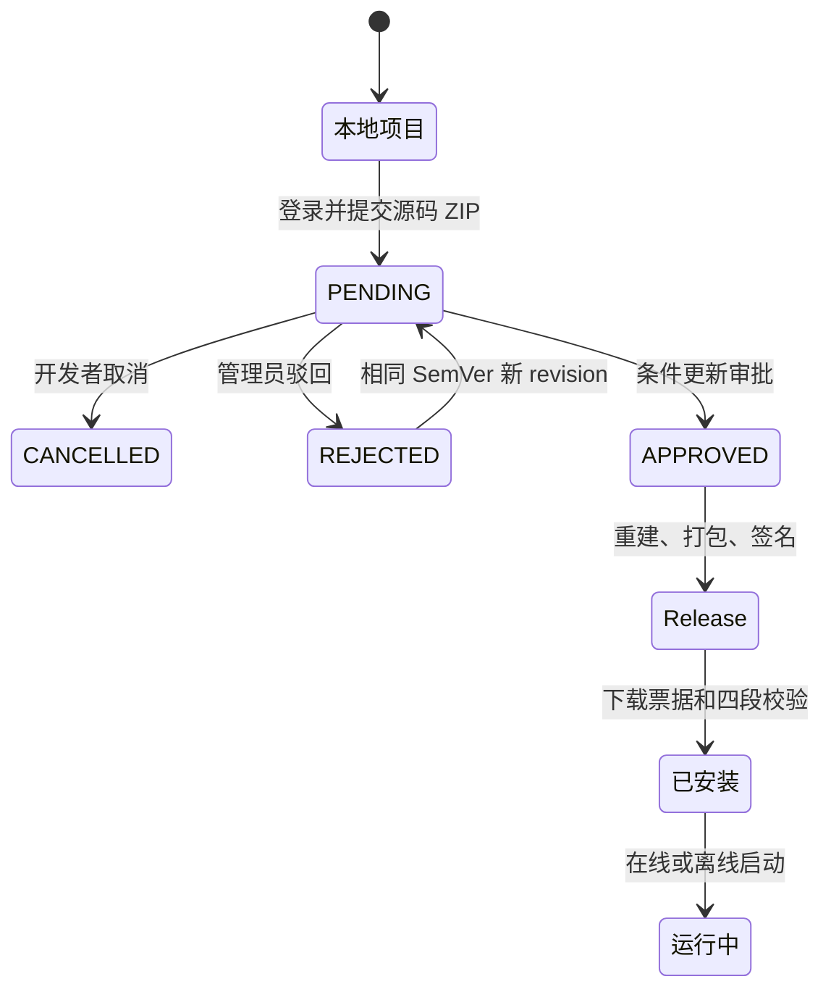

# 工作流生命周期

## 项目契约

```text
workflow-project/
├── workflow.json
├── README.md
├── tsconfig.json
├── sdk/index.d.ts
└── src/index.ts
```

`workflow.json` 由 `@autoforge/workflow-contracts` 严格校验。入口恒为 `dist/index.mjs`，源码恒为 `src/index.ts`；只允许从 `@autoforge/workflow-sdk` 做类型导入，不运行 package script，也不接受第三方运行时依赖。

## 状态流



同一工作流的同一 SemVer 只能生成一个 Release。审批先将发布对象写入 S3，再在数据库事务中条件更新 Submission 并创建 Release；事务失败会删除孤立对象。

## 安装校验

1. 以内置 `keyId → publicKey` 验证 Ed25519 签名。
2. 下载到内存并验证 `packageSha256`。
3. 拒绝绝对路径、`..`、反斜杠和白名单外文件。
4. 验证 Manifest、版本、slug 和 `codeSha256`。
5. 写入临时目录并 rename，最后更新 SQLite 的当前版本指针。

任何一步失败都不会替换旧指针。

## 执行安全边界

- 可见 target WebContents 负责目标网站；隐藏 runner WebContents 负责加载工作流模块。
- runner 开启 sandbox/contextIsolation，关闭 Node；CSP 和 session 请求过滤同时阻断外部网络。
- runner preload 只暴露固定 `call(executionId, method, args)`；主进程同时核对 sender webContentsId 与 executionId。
- 每次 SDK 调用检查 Manifest 权限、目标域名、参数长度和 15 秒超时；整次执行最多 10 分钟。
- 不暴露 CDP、Cookie、localStorage、文件系统、任意网络或原始 `executeJavaScript`。
- 本地调试、管理员试运行和已安装运行都进入同一个 `WorkflowExecutionService`。

## 服务接口

- 认证：`/api/v1/auth/register|login|refresh|logout|me`
- 大厅：`GET /api/v1/categories|workflows|workflows/:id`
- 安装：`POST /api/v1/workflows/:id/releases/:version/download-ticket`
- 开发者：`/api/v1/developer/workflows`、`/api/v1/developer/submissions`
- 管理员：`/api/v1/admin/submissions`、`approve`、`reject`、`trial-ticket`
- 分类：`/api/v1/admin/categories`
- 健康：`/health/live`、`/health/ready`

大厅页码从 1 开始，默认 20，最大 50。搜索覆盖名称、描述、作者和 slug。
